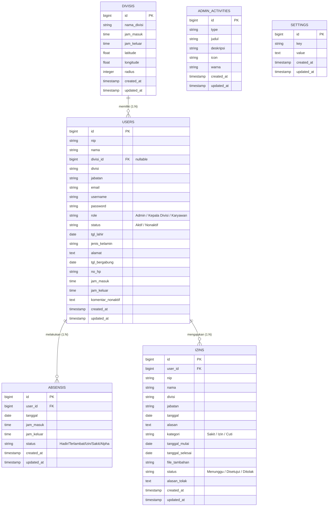

# Database Entity Relationship Diagram (ERD)

Berikut adalah diagram relasi entitas (ERD) untuk database aplikasi absensi berdasarkan struktur tabel terbaru.

> [!NOTE]
> - Tabel `karyawans` tidak dimasukkan karena strukturnya sudah digabung (di-*merge*) sepenuhnya ke dalam tabel `USERS`.
> - Tabel `perizinans` juga tidak dimasukkan karena telah tergantikan oleh tabel `IZINS`.
> - Tabel bawaan framework Laravel (seperti `migrations`, `sessions`, `cache`, dan `jobs`) disembunyikan agar diagram fokus pada domain bisnis aplikasi.
